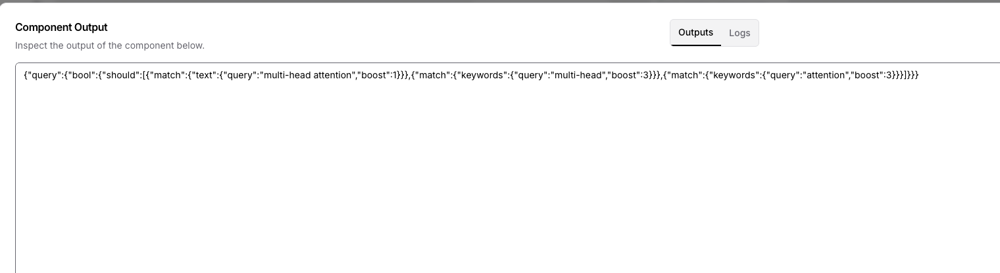

# RAG Pipeline with Langflow and OpenSearch

This project demonstrates how to build a Retrieval-Augmented Generation (RAG) system using Langflow's visual interface with OpenSearch as the vector store. It includes a Python ingestion script that uses Unstructured.io to parse documents and create proper schema for hybrid search.

## Architecture

```
┌─────────────────────────────────────────────────────────────────┐
│                         LANGFLOW                                 │
│  ┌──────────────┐    ┌──────────────┐    ┌──────────────┐      │
│  │ Unstructured │ -> │  OpenSearch  │ -> │    LLM       │      │
│  │   Loader     │    │ Vector Store │    │ (watsonx/    │      │
│  │              │    │              │    │  OpenAI)     │      │
│  └──────────────┘    └──────────────┘    └──────────────┘      │
└─────────────────────────────────────────────────────────────────┘
                               │
                               ▼
┌─────────────────────────────────────────────────────────────────┐
│                    Docker (OpenSearch)                          │
└─────────────────────────────────────────────────────────────────┘
```




Langflow provides a visual drag-and-drop interface for building RAG flows. Documents are parsed using Unstructured.io, stored in OpenSearch with vector embeddings, and retrieved to augment LLM responses.

## Prerequisites

Before starting, ensure you have Docker Desktop and Python 3.9+ installed. You can verify with `docker --version` and `python --version`.

Docker runs OpenSearch as a background service on port 9200. Python runs Langflow separately, which connects to OpenSearch over HTTP.

---

## Quick Start

### Step 1: Start OpenSearch

Navigate to the project directory and start the OpenSearch containers:

```bash
cd /path/to/Unstructured_OpenSearch
docker-compose up -d
```

Verify it's running:

```bash
curl http://localhost:9200
```

### Step 2: Set Up Python Environment

Create and activate a virtual environment, then install Langflow:

```bash
python -m venv venv
source venv/bin/activate  # On Windows: venv\Scripts\activate

pip install uv
uv pip install --upgrade langflow
uv pip install fastapi==0.123.6  # Required compatibility fix
```

The FastAPI downgrade addresses a known compatibility issue in the Langflow community.

### Step 3: Set Environment Variables

You'll need API keys for document parsing and your choice of LLM:

```bash
# For PDF processing
export UNSTRUCTURED_API_KEY="your-unstructured-api-key"

# Choose one LLM provider:

# IBM watsonx.ai
export WATSONX_API_KEY="your-api-key"
export WATSONX_PROJECT_ID="your-project-id"
export WATSONX_URL="https://us-south.ml.cloud.ibm.com"

# Or OpenAI
export OPENAI_API_KEY="your-openai-api-key"
```

### Step 4: Create the OpenSearch Index

OpenSearch 3.x requires pre-creating the index with the correct vector field configuration. Langflow defaults to a deprecated engine that won't work otherwise.

```bash
curl -X PUT "http://localhost:9200/langflow" -H 'Content-Type: application/json' -d '
{
  "settings": { "index": { "knn": true } },
  "mappings": {
    "properties": {
      "vector_field": {
        "type": "knn_vector",
        "dimension": 1536,
        "method": { "name": "hnsw", "space_type": "cosinesimil", "engine": "faiss" }
      },
      "text": { "type": "text" },
      "metadata": { "type": "object", "enabled": true }
    }
  }
}
'
```

The dimension of 1536 matches OpenAI's `text-embedding-3-small` model. Adjust this if using a different embedding model (e.g., 384 for HuggingFace's all-MiniLM-L6-v2).

### Step 5: Start Langflow

```bash
langflow run
```

Open http://localhost:7860 in your browser.

---

## Ingesting Documents with the Python Script

The `scripts/ingest_unstructured_opensearch.py` script provides a complete ingestion pipeline with proper schema for hybrid search (BM25 + Vector).

### Features

- Parses documents using Unstructured.io API
- Generates embeddings using OpenAI
- Creates optimized OpenSearch schema with custom analyzers
- Extracts keywords automatically for hybrid search boosting
- Supports PDF, DOCX, TXT, MD, and HTML files

### Usage

```bash
# Activate your virtual environment
source venv/bin/activate

# Install dependencies
pip install -r requirements.txt

# Set required environment variables
export UNSTRUCTURED_API_KEY="your-key"
export OPENAI_API_KEY="your-key"

# Ingest a single file
python scripts/ingest_unstructured_opensearch.py --file /path/to/document.pdf

# Ingest a directory
python scripts/ingest_unstructured_opensearch.py --dir /path/to/documents/

# Specify index name
python scripts/ingest_unstructured_opensearch.py --dir ./data --index my_index

# Recreate index (deletes existing data)
python scripts/ingest_unstructured_opensearch.py --dir ./data --recreate

# Use LLM for better keyword extraction (costs API calls)
python scripts/ingest_unstructured_opensearch.py --dir ./data --llm-keywords
```

### Index Schema

The script creates an optimized schema for hybrid search:

- `text` - Main content with custom analyzer for BM25 ranking
- `vector_field` - Embeddings for semantic search
- `keywords` - Extracted keywords with boosting for exact matches
- `title` - Document titles with higher relevance boost
- `metadata` - File info, page numbers, categories

---

## Building Flows in Langflow

### Document Ingestion Flow

Connect these components to load and index documents:

1. **File Loader** - Points to your document directory
2. **Unstructured** - Parses PDFs and extracts text
3. **Text Splitter** - Chunks documents (1000 chars, 200 overlap)
4. **Embeddings** - Generates vectors
5. **OpenSearch Vector Store** - Stores everything

For the Unstructured component, use these settings:
- API URL: `https://api.unstructuredapp.io/general/v0/general`
- Strategy: `hi_res` for best results, `fast` for speed

### RAG Query Flow

Connect these components to answer questions:

1. **Chat Input** - User's question
2. **OpenSearch Vector Store** - Retrieves relevant chunks (k=5)
3. **Prompt Template** - Combines context with question
4. **LLM** - Generates the answer
5. **Chat Output** - Displays response

Use this prompt template:

```
You are a helpful assistant that answers questions based on the provided context.

Context:
{context}

Question: {question}

Rules:
- Only use information from the context above
- If the context doesn't contain the answer, say so
- Cite sources when possible
- Be concise but thorough

Answer:
```

---

## Hybrid Search in Langflow

Hybrid search combines keyword matching (BM25) with semantic understanding (vectors) for better results. This requires an additional component to extract keywords from the user's question.

### Flow Architecture

```
Chat Input ──┬──→ Prompt (Keyword Extractor) → LLM (gpt-4o-mini) ──┐
             │                                                      │
             ├──→ Embedding Model ─────────────────────────────────┐│
             │                                                     ││
             └──→ OpenSearch ←─────────────────────────────────────┘│
                    │         (Search Query, Embedding,             │
                    │          Hybrid Search Query) ←───────────────┘
                    ▼
               Prompt (RAG) → LLM (gpt-4o) → Chat Output
```

### Keyword Extractor Prompt

Copy this prompt into a Prompt component connected to a fast LLM like gpt-4o-mini:

```
You are a keyword extractor for OpenSearch hybrid search.

The VECTOR/SEMANTIC search is handled automatically.
Your job is ONLY to generate the KEYWORD query part with field boosting.

Question: {question}

Rules:
- Extract 1-3 CORE technical terms only
- For keywords field: use 1-2 most specific terms (exact match, boost 3)
- For text field: use the main concept only (boost 1)
- FEWER keywords = BETTER exact matching
- Output ONLY raw JSON

Format:
{{"query":{{"bool":{{"should":[{{"match":{{"text":{{"query":"<main concept>","boost":1}}}}}},{{"match":{{"keywords":{{"query":"<1-2 specific terms>","boost":3}}}}}}]}}}}}}

Examples:

Q: "What is multi-head attention?"
{{"query":{{"bool":{{"should":[{{"match":{{"text":{{"query":"multi-head attention","boost":1}}}}}},{{"match":{{"keywords":{{"query":"multi-head attention","boost":3}}}}}}]}}}}}}

Q: "What BLEU score was achieved?"
{{"query":{{"bool":{{"should":[{{"match":{{"text":{{"query":"BLEU score","boost":1}}}}}},{{"match":{{"keywords":{{"query":"BLEU","boost":3}}}}}}]}}}}}}

JSON:
```

The double braces `{{` and `}}` are required because Langflow uses single braces for variables.

### Connections

1. Chat Input → Prompt (Keyword Extractor) as `{question}`
2. Prompt → LLM → OpenSearch's `Hybrid Search Query` input
3. Chat Input → OpenSearch's `Search Query` input
4. Embedding Model → OpenSearch's `Embedding` input
5. OpenSearch → RAG Prompt → LLM → Chat Output

---

## Project Structure

```
Unstructured_OpenSearch/
├── docker-compose.yml          # OpenSearch containers
├── requirements.txt            # Python dependencies
├── README.md                   # This file
├── env-example.txt             # Environment variable template
├── .gitignore
├── data/                       # Place your documents here
└── scripts/
    └── ingest_unstructured_opensearch.py  # Document ingestion script
```

---

## Access Points

| Service | URL | Purpose |
|---------|-----|---------|
| Langflow | http://localhost:7860 | Visual flow builder |
| OpenSearch | http://localhost:9200 | Vector store API |
| OpenSearch Dashboards | http://localhost:5601 | Data exploration |

---

## OpenSearch Commands

Common commands for managing OpenSearch:

```bash
# Start containers
docker-compose up -d

# Check status
docker-compose ps

# View logs
docker-compose logs -f opensearch

# Stop containers
docker-compose down

# Stop and remove all data
docker-compose down -v
```

Verify OpenSearch is working:

```bash
curl http://localhost:9200
curl http://localhost:9200/_cat/indices?v
curl http://localhost:9200/langflow/_count
```

---

## OpenSearch Dev Tools Queries

Access Dev Tools at http://localhost:5601 and try these queries:

```
# Browse documents
GET langflow/_search
{"size": 10, "_source": ["text", "metadata"], "query": {"match_all": {}}}

# Text search
GET langflow/_search
{"query": {"match": {"text": "hybrid search"}}}

# Check vectors exist
GET langflow/_search
{"size": 1, "_source": ["vector_field"], "query": {"exists": {"field": "vector_field"}}}

# Delete all documents (keeps index)
POST langflow/_delete_by_query
{"query": {"match_all": {}}}

# Delete index entirely
DELETE langflow
```

---

## LLM Configuration

### IBM watsonx.ai

Set these environment variables before starting Langflow:

```bash
export WATSONX_API_KEY="your-api-key"
export WATSONX_PROJECT_ID="your-project-id"
export WATSONX_URL="https://us-south.ml.cloud.ibm.com"
```

Recommended models:
- `ibm/granite-13b-chat-v2` for general Q&A
- `meta-llama/llama-3-70b-instruct` for complex reasoning

### OpenAI

```bash
export OPENAI_API_KEY="your-api-key"
```

---

## Troubleshooting

**SSL Error: `[SSL] record layer failure`**

Langflow is trying HTTPS but local OpenSearch uses HTTP. Ensure your URL is `http://localhost:9200` (not `https://`).

**`nmslib engine is deprecated`**

OpenSearch 3.x removed the nmslib engine. Pre-create the index with `faiss` engine as shown in the Quick Start section.

**`Field 'vector_field' is not knn_vector type`**

The index was created with the wrong field configuration. Delete it and recreate using the curl command in Step 4.

**`vm.max_map_count [65530] is too low`**

OpenSearch needs more virtual memory. On macOS, run:

```bash
docker run -it --privileged --pid=host debian nsenter -t 1 -m -u -n -i sh
sysctl -w vm.max_map_count=262144
exit
docker-compose up -d
```

This setting resets when Docker restarts.

**Langflow startup errors with FastAPI**

Downgrade FastAPI: `uv pip install fastapi==0.123.6`

**Hybrid Search: `Unknown key for a START_OBJECT in [bool]`**

The JSON is missing the `query` wrapper. Use `{"query":{"bool":{"should":[...]}}}` format.

**Hybrid Search: LLM outputs markdown**

Add to your prompt: "Output ONLY raw JSON - no markdown, no backticks"

**Unstructured API is slow**

The `hi_res` strategy uses ML models. Switch to `fast` for quicker processing.

---

## Tips

Start with a basic RAG flow before adding hybrid search complexity. Use OpenSearch Dashboards to verify documents are indexed correctly. Adjust chunk sizes based on your document types.

For hybrid search, use a fast LLM like gpt-4o-mini for keyword extraction since it runs on every query. Extract fewer keywords (1-3) for better precision.

---

## Resources

- [Langflow Documentation](https://docs.langflow.org/)
- [OpenSearch Documentation](https://opensearch.org/docs/latest/)
- [OpenSearch Hybrid Search](https://opensearch.org/docs/latest/search-plugins/hybrid-search/)
- [Unstructured.io Documentation](https://docs.unstructured.io/)
- [watsonx.ai Documentation](https://www.ibm.com/docs/en/watsonx-as-a-service)
